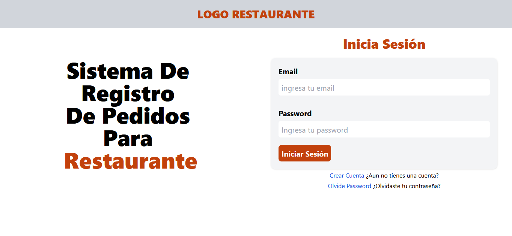
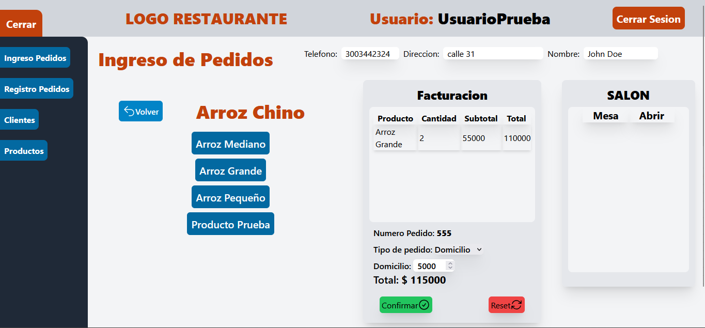
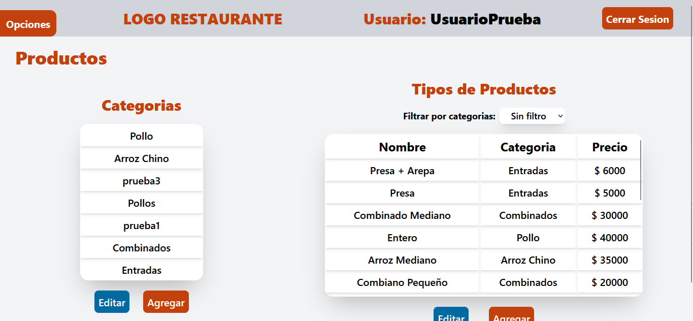
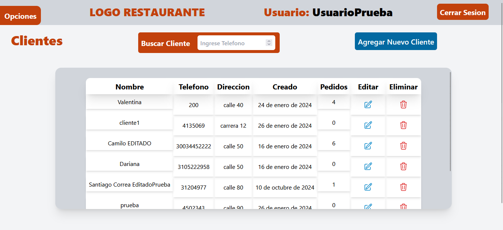

# 🍔 RestaurantSystem - Frontend Client

<div align="center">
  
  
  
  
  
  
  
</div>

<br />

**RestaurantSystem Frontend** is the user-facing web client of a comprehensive, production-grade restaurant management and Point of Sale (POS) system. Designed to streamline daily restaurant operations, it provides staff and administrators with tools to register new orders (Dine-in, Delivery, or Takeout), manage real-time inventory, track client statistics (CRM), and manage billing logs.

### 🚀 **Live Demo URL:** [https://sistema-restaurante-next-js-frontend.vercel.app](https://sistema-restaurante-next-js-frontend.vercel.app)

> 🔑 **Staff Demo Account Credentials:**  
> **User:** `prueba@prueba.com`  
> **Password:** `password`

---

## 📖 Table of Contents

- [Application Modules](#-application-modules)
- [Key Features](#-key-features)
- [Tech Stack & Architecture](#-tech-stack--architecture)
- [Client Routing System](#-client-routing-system)
- [Getting Started](#-getting-started)
- [Project Structure](#-project-structure)
- [Screenshots](#-screenshots)
- [Author](#-author)

---

## 🎯 Application Modules

The client application is divided into four major interactive panels:

1. **POS Order Desk (`IngresoPedidos`):** A dynamic form panel where waitstaff select the client, classify the order type (**Salon / Dine-in**, **Para Llevar / Takeout**, or **Domicilio / Delivery**), select dishes from dynamic category filters, and calculate subtotals and totals.
2. **Category & Product Manager:** An inventory dashboard showing categorized lists of products. Allows updating status, pricing, and creating categories on-the-fly.
3. **CRM Client Hub:** A dedicated dashboard for tracking regular guests. Displays guest profiles and their order count.
4. **Order History Logs:** Displays billed invoices, detailed checkout status (Paid, Pending), and metadata logs. Admin users have exclusive rights to cancel or delete entries.

---

## ✨ Key Features

- **Dynamic POS Ordering:** Fluid interface to compose order carts, select order destinations, and apply dynamic client links.
- **Client Metrics (CRM):** Real-time orders calculator per client, assisting management in recognizing loyal customers.
- **State Preservation & Loading Feedback:** Local states with customized spinners (`animate-spin`) and form validations preventing duplicate server submissions.
- **Form Validation:** Client-side schemas built with Formik and Yup ensure precise, structured input during authentication, product registration, and POS actions.
- **Responsive Layout:** Tailored with CSS grid patterns for desktop POS terminals and portable order tablets.
- **Modern Alerts:** Integrates SweetAlert2 and React-Toastify to deliver notifications.

---

## 🛠 Tech Stack & Architecture

- **Core Engine:** [Next.js (Pages Router)](https://nextjs.org/) & React 18
- **Styling System:** Tailwind CSS v3
- **Form Handling:** Formik & Yup Schema validations
- **API Communication:** Axios (centralized client configuration with auto-token attachments)
- **State Management:** React Context API & `useReducer` for clean global scope division (e.g. AuthContext, AppContext).

---

## 🛣 Client Routing System

Built utilizing Next.js file-based routing:
- `/` - Main POS Dashboard (Order processing and navigation hub)
- `/login` - Staff authentication login portal
- `/crearCuenta` - Staff account registration form
- `/confirmarCuenta/[token]` - Token validation landing page
- `/olvidePassword` - Forgot password request and recovery screen

---

## 🚀 Getting Started

### Prerequisites

- Node.js (v18 or higher)
- Backend API running locally (or remote server URL configured)

### Installation & Launch

1. **Clone the repository:**
   ```bash
   git clone https://github.com/CamiloVelasquezBotero/RestaurantSystem_Next.js_Client.git
   cd RestaurantSystem_Next.js_Client
   ```

2. **Install project dependencies:**
   ```bash
   npm install
   ```

3. **Configure Environment Variables:**
   Create an `.env.local` file in the root directory:
   ```env
   NEXT_PUBLIC_BACKEND_URL="http://localhost:4000/api"
   ```

4. **Start Development Server:**
   ```bash
   npm run dev
   ```
   Open [http://localhost:3000](http://localhost:3000) to view the client app in your browser.

---

## 📁 Project Structure

```text
RestaurantSystem_Next.js_Client/
├── public/                 # Static vector icons and restaurant banners
├── src/
│   ├── components/         # Reusable Layouts, Modals, Forms & POS sections
│   │   ├── IngresoPedidos.jsx  # Order creation engine
│   │   ├── Clientes.jsx        # CRM customer listings
│   │   └── Layout.jsx          # Sidebar and main frame template
│   ├── config/             # Centered Axios base client instance
│   │   └── clienteAxios.js
│   ├── context/            # React Context API states and reducers
│   │   ├── app/            # POS products, filters and UI state
│   │   └── auth/           # Authenticated session and account status
│   ├── pages/              # Next.js Pages Router views
│   ├── styles/             # Global CSS and configuration files
│   └── types/              # System Action Types dictionary
├── tailwind.config.js      # Styling configuration definitions
├── package.json            # Scripts & project dependencies
└── README.md               # Frontend project documentation
```

---

## 📸 Screenshots

<details>
<summary>Click to view client screenshots</summary>

- **Staff Authentication Screen:** 
- **POS Ordering Panel:** 
- **Inventory & Category Dashboard:** 
- **Client Records List:** 

</details>

---

## 👨💻 Author

**Camilo Velásquez Botero**  
Full Stack Web Developer  
- [GitHub](https://github.com/CamiloVelasquezBotero)
- [LinkedIn](https://www.linkedin.com/in/camilodeveloper)